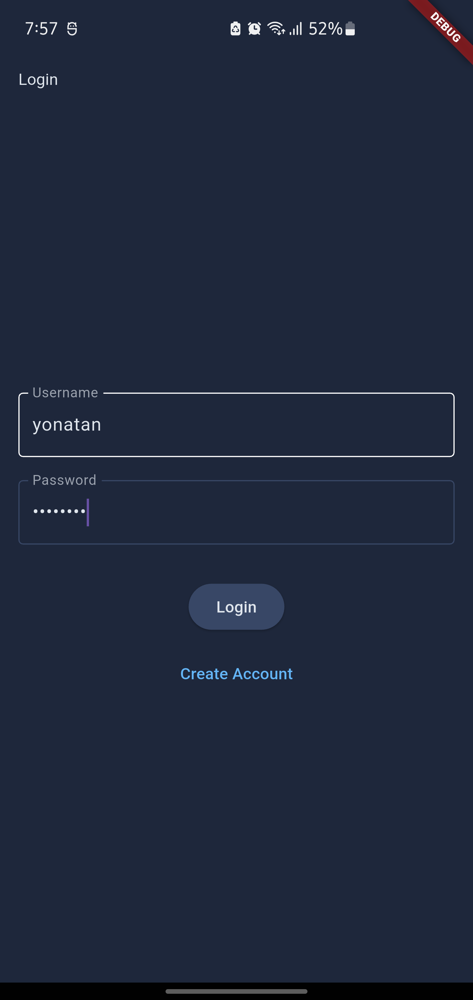
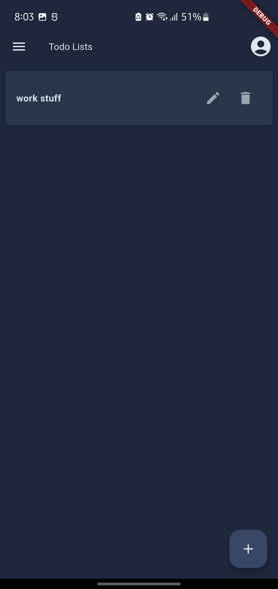
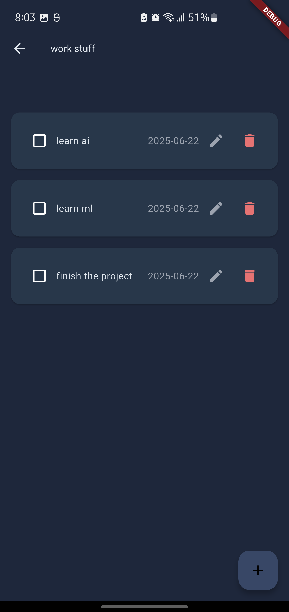

# Todo Microservices Backend

This project is a microservices-based backend for a Todo application, built with Java Spring Boot. It features three main services—Authentication, Profile, and Task management—communicating via REST APIs and RabbitMQ for event-driven messaging.

## Architecture Overview

- **Microservices**: Each core domain (Auth, Profile, Task) is a separate Spring Boot service, with its own database.
- **RabbitMQ**: Used for asynchronous, event-driven communication (e.g., user registration events).
- **PostgreSQL**: Each service has its own isolated database instance.
- **Docker Compose**: Orchestrates all services, databases, and RabbitMQ for local development.

```
+----------------+         +-------------------+         +----------------+
|  Auth Service  |  --->   |  Profile Service  |  --->   |  Task Service  |
+----------------+         +-------------------+         +----------------+
        |                         |                            |
        |---- REST APIs ----------|                            |
        |                         |                            |
        |---- RabbitMQ (events)---->                            |
```

## Mobile App Screenshots

Below are screenshots from the Todo mobile app, showcasing key features and UI screens:

| Login Screen | Todo List | Task Details | Profile |
|:------------:|:---------:|:------------:|:-------:|
|  |  |  |  |

*Screenshots from the Flutter mobile client*

## Services

### 1. Auth Service (`authService`)
- Handles user registration and authentication (JWT-based).
- Publishes `UserRegisteredEvent` to RabbitMQ when a new user registers.
- Exposes REST endpoints for registration and login.

### 2. Profile Service (`profileService`)
- Manages user profile data.
- Listens to `UserRegisteredEvent` from RabbitMQ to auto-create user profiles.
- Exposes REST endpoints for profile CRUD operations.

### 3. Task Service (`taskService`)
- Manages todo lists and items for users.
- Exposes REST endpoints for CRUD operations on todo lists and items.

## Inter-Service Communication

### REST APIs
- Services communicate with clients (and sometimes each other) via RESTful HTTP endpoints.

### RabbitMQ (Event-Driven)
- **Event:** `UserRegisteredEvent` (published by Auth Service, consumed by Profile Service)
- **Purpose:** Decouples user registration from profile creation, enabling scalability and resilience.
- **Event Structure:**
  - `userId` (String)
  - `username` (String)
  - `email` (String)
  - `registrationTimestamp` (Instant)

## API Endpoints

### Auth Service
- `POST /api/v1/users/register` — Register a new user
- `POST /api/v1/auth/login` — Authenticate and receive JWT
- `GET /api/v1/test` — Health check

### Profile Service
- `GET /api/v1/users/{userId}` — Get user profile by Auth ID
- `GET /api/v1/users/` — List all user profiles (admin only)
- `GET /api/v1/users/me` — Get current user's profile
- `PUT /api/v1/users/me` — Update current user's profile
- `POST /api/v1/users` — Create a user profile (used internally)
- `GET /api/v1/users/test` — Health check

### Task Service
#### Todo Items
- `POST /api/v1/todo-items` — Create a todo item
- `GET /api/v1/todo-items` — List all todo items
- `GET /api/v1/todo-items/{id}` — Get a todo item by ID
- `GET /api/v1/todo-items/lists/{todoListId}` — List items for a specific todo list
- `PUT /api/v1/todo-items/{id}` — Update a todo item
- `DELETE /api/v1/todo-items/{id}` — Delete a todo item

#### Todo Lists
- `POST /api/v1/todo-lists` — Create a todo list
- `GET /api/v1/todo-lists` — List all todo lists
- `GET /api/v1/todo-lists/{id}` — Get a todo list by ID
- `PUT /api/v1/todo-lists/{id}` — Update a todo list
- `DELETE /api/v1/todo-lists/{id}` — Delete a todo list

## Running Locally

1. **Prerequisites:** Docker, Docker Compose, Java 21, Maven
2. **Environment Variables:** Copy `.env.example` to `.env` and fill in secrets (see `docker-compose.yml` for required variables).
3. **Start All Services:**
   ```sh
   cd backend
   docker-compose up --build
   ```

## Notes
- Each service is independently deployable and scalable.
- RabbitMQ is used for decoupled, reliable event delivery.
- All services use JWT for authentication and authorization.

---

For more details, see each service's source code and configuration files. 